  
  
  
  
  

  

# 🤖 Awesome Computer-Use Agents | Autonomous AI Desktop & Browser Control

> **Curated List of SaaS Platforms & Open-Source Projects for AI Computer-Use Agents, Desktop Automation, Vision LLMs, GUI Agents, and Autonomous Web Browsing.**

*Last updated: September 2026* 📅

---

## 💡 Overview & Introduction

**Computer Use Agents** represent the next paradigm shift in Artificial Intelligence. Unlike standard LLM chat interfaces, these AI agents perceive screens (via multimodal vision/screenshots or DOM structures), formulate multi-step plans, and directly interact with computer environments—clicking, typing, navigating applications, and operating software like humans.

This repository tracks the leading **SaaS/Hosted Platforms** and **Open-Source GitHub Frameworks** driving autonomous desktop automation, browser control, and GUI interaction.

---

## 📑 Table of Contents

- [📊 Sector Market Overview](#-sector-market-overview)
- [🏢 SaaS & Hosted Commercial Platforms](#-saas--hosted-commercial-platforms)
- [⭐ Open-Source GitHub Projects](#-open-source-github-projects)
- [🏗️ Architectural Blueprints & Patterns](#-architectural-blueprints--patterns)
- [🤝 How to Contribute](#-how-to-contribute)
- [🛡️ Security & Operational Disclaimer](#-security--operational-disclaimer)
- [📈 Star History](#-star-history)
- [💖 Support & Community](#-support--community)

---

## 📊 Sector Market Overview

> 📈 **Market Size & Industry Structure**: The global Computer-Use AI Agent & Autonomous GUI Automation sector is estimated at **$2.4 Billion (2024)** and projected to reach **$28.5 Billion by 2030** (CAGR: ~50.2%). The sector is currently **highly fragmented**, characterized by intense competition between frontier AI labs (OpenAI, Anthropic, Google) building core foundation computer-use models, and specialized agent startups building vertical workflow automation platforms.

---

## 🏢 SaaS & Hosted Commercial Platforms

Below is a comparative breakdown of commercial computer-use agent platforms, **sorted by company size (valuation/revenue) in descending order**.

| Product / Platform 🚀 | Parent Company 🏢 | Company Size (Valuation / Rev) 💰 | Starting Pricing 💵 | Free Tier / Trial Limits 🎁 | Key Capabilities & Focus ⚡ |
| :--- | :--- | :--- | :--- | :--- | :--- |
| **[OpenAI Operator / ChatGPT Agent](https://openai.com/)** | OpenAI | **~$157 Billion** ($3.7B+ ARR) | $20/month (ChatGPT Plus) | No free plan (requires $20/mo ChatGPT Plus or paid API) | Operates browser & virtual desktop environments for multi-step consumer and enterprise task execution. |
| **[Claude (Anthropic Computer Use)](https://www.anthropic.com/)** | Anthropic | **~$40 Billion** ($1B+ ARR) | $20/month (Pro) / $3.00/M in, $15/M out API | Free basic plan on Claude.ai (computer-use API feature requires paid API credits) | Screenshot-based multimodal GUI perception, OS tool execution, and fine-grained computer action controls. |
| **[Perplexity Computer](https://www.perplexity.ai/)** | Perplexity AI | **~$9 Billion** ($50M+ ARR) | $20/month (Perplexity Pro) | 5 free Pro searches per 4 hours on web and app | Deep web research synthesis, autonomous browser navigation, and automated tool execution. |
| **[MultiOn](https://www.multion.ai/)** | MultiOn AI | **~$30 Million** ($4M+ raised) | $19/month (Pro Plan) | 40 free agent runs per month | Autonomous Web Agent API & Chrome Extension operating websites via natural language prompts. |
| **[Browser-Use Cloud](https://browser-use.com/)** | Browser-Use Inc. | **~$10 Million** ($5M raised) | $49/month (Starter Cloud) | 100 free browser task runs per month | Managed cloud browser fleet with anti-bot evasion, stealth proxies, and high-concurrency agent orchestration. |
| **[Bytebot](https://www.bytebot.ai/)** | Bytebot AI | **~$5 Million** (Pre-seed / Seed) | $29/month (Starter Builder) | 14-day free trial with 50 desktop task executions | Practical desktop and workflow automation platform operating native OS software & browser UI seamlessly. |

---

## ⭐ Open-Source GitHub Projects

The open-source computer-use ecosystem is expanding rapidly, giving developers complete control over data privacy, custom model integration, and local execution.

**Sorted by GitHub Star Count (Descending):**

### 1. 🌐 [Playwright](https://github.com/microsoft/playwright) 

- **Description**: Reliable end-to-end browser automation framework for modern web apps (Node.js, Python, Java, .NET).
- **Computer-Use Role**: Serves as the standard execution layer and sandbox for most open-source browser agents.

### 2. 💻 [Open Interpreter](https://github.com/OpenInterpreter/open-interpreter) 

- **Description**: Open-source local agent that lets LLMs execute Python/JS code, operate terminal environments, and control local desktop OS via natural language.
- **Key Features**: Local model support (Ollama/LM Studio), OS GUI navigation, code execution safety controls.

### 3. 🌐 [Browser-Use](https://github.com/browser-use/browser-use) 

- **Description**: The premier open-source web agent framework (Python/TypeScript) making websites accessible for LLMs.
- **Key Features**: Auto-converts websites into LLM-friendly trees, handles multi-tab navigation, clicks, fills forms, and solves complex web workflows; MIT licensed.

### 4. 🤼 [OpenManus](https://github.com/mannaandpoetry/open-manus) 

- **Description**: Open-source multi-agent browser execution system inspired by Manus and Browser-Use.
- **Key Features**: Asynchronous task planning, multi-agent collaboration, web automation execution layer.

### 5. 🖥️ [Self-Operating Computer Framework](https://github.com/OthersideAI/self-operating-computer) 

- **Description**: Open multimodal framework enabling VLMs (GPT-4o, Claude 3.5, Gemini) to operate a desktop via screenshots and virtual mouse/keyboard actions.
- **Key Features**: Screen perception coordinates, OS-agnostic control (macOS, Windows, Linux).

### 6. 🦅 [Skyvern](https://github.com/skyvern-ai/skyvern) 

- **Description**: Computer-vision and LLM-based web automation platform replacing fragile DOM parsers.
- **Key Features**: Automated complex form filling, anti-bot navigation, visual site scraping across arbitrary websites without customized code.

### 7. 🎯 [UI-TARS](https://github.com/bytedance/ui-tars) 

- **Description**: Open native GUI agent model family developed by ByteDance focused on human-like visual perception and action grounding.
- **Key Features**: State-of-the-art GUI grounding performance on web, mobile, and desktop operating systems.

### 8. 📦 [E2B (Desktop & Code Sandbox)](https://github.com/e2b-dev/E2B) 

- **Description**: Open-source secure cloud sandboxing infrastructure designed specifically for AI agents and computer-use environments.
- **Key Features**: Virtual machine sandboxing, desktop environment hosting, programmatic browser control.

### 9. 🌊 [LaVague](https://github.com/lavague-ai/LaVague) 

- **Description**: Large Action Model (LAM) framework generating executable browser automation pipelines from natural language.
- **Key Features**: Integrates Playwright, Selenium, and custom VLM engines for enterprise automation.

### 10. 🔌 [Model Context Protocol (MCP) Servers](https://github.com/modelcontextprotocol/servers) 

- **Description**: Official reference implementation of standardized protocol servers exposing desktop, browser, and local tool capabilities to AI agents.
- **Key Features**: Standardized tool schemas, secure local IPC, modular computer-use integration.

---

## 🏗️ Architectural Blueprints & Patterns

When engineering custom computer-use systems:
1. **Perception Layer**: Select DOM-tree representation (e.g. Browser-Use) for web-only speed, or Screenshot-VLM coordinates for full desktop software.
2. **Model Layer**: Pair frontier vision-language models (Claude 3.5 Sonnet, GPT-4o, UI-TARS) with specialized task planners.
3. **Execution Sandbox**: Isolate agent execution inside cloud containers (E2B, Docker, ephemeral VMs) to isolate system state and prevent unwanted actions.
4. **Human-in-the-Loop (HITL)**: Implement explicit approval gates for high-risk actions (e.g., financial transactions, account deletions, external communications).

---

## 🤝 How to Contribute

Contributions from the AI community are warmly welcomed!

1. 🍴 **Fork the repository**.
2. 📝 **Add or edit entries** in `README.md` following the standard table/section format.
3. 🔗 **Ensure accurate links**, factual pricing, and concise descriptions.
4. 🚀 **Submit a Pull Request** detailing your additions.

Please review our awesome list guidelines at [Awesome-Awesome-Awesome](https://github.com/ishandutta2007/Awesome-Awesome-Awesome).

---

## 🛡️ Security & Operational Disclaimer

- Computer-use agents operate real mouse, keyboard, and browser interfaces. Always execute untrusted agent code within **isolated sandboxes**.
- Implement rate limiting, credentials management, and strict human confirmation steps for sensitive actions.
- This repository is a community-curated directory and does not constitute endorsement or security guarantees for listed tools.

---

## 📈 Star History

---

## 💖 Support & Community

If you find this curated awesome list valuable, please consider supporting the project:

- 🌟 **Star this repository** on GitHub to increase visibility for open-source AI agent research!
- 🔀 **Fork & Share** this list with fellow automation engineers and AI developers.
- ☕ **Sponsor the developer**: Support ongoing maintenance via the [GitHub Sponsor Dashboard](https://github.com/sponsors/ishandutta2007).

---

  <b>Built for AI Engineers, Automation Builders, and Open-Source Agent Researchers worldwide.</b> 🚀

